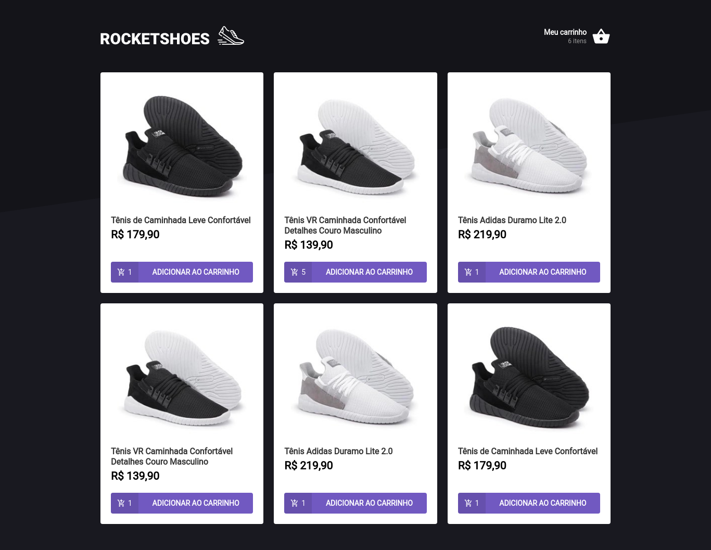

<h1 align="center">RocketShoes</h1>

<p align="center">
	

  

  
</p>

<p align="center">
	
</p>

## 💻  Sobre o desafio

Essa será uma aplicação onde o seu principal objetivo é criar um hook de carrinho de compras. Você terá acesso a duas páginas, um componente e um hook para implementar as funcionalidades pedidas nesse desafio:

- Adicionar um novo produto ao carrinho;
- Remover um produto do carrinho;
- Alterar a quantidade de um produto no carrinho;
- Cálculo dos preços sub-total e total do carrinho;
- Validação de estoque;
- Exibição de mensagens de erro;
- Entre outros.

## 🧪 Tecnologias

Esse projeto foi desenvolvido com as seguintes tecnologias:

#### **Website**  ([ReactJS](https://reactjs.org/) +  [TypeScript](https://www.typescriptlang.org/) )
<br>

## 🚀 Como executar

### Pré-requisitos

Antes de começar, você vai precisar ter instalado em sua máquina as seguintes ferramentas:
[Git](https://git-scm.com), [Node.js](https://nodejs.org/en/).

#### 🧭 Rodando a aplicação

```bash

# Clone este repositório
$ git@github.com:araujo-jp/RocketShoes.git

# Acesse a pasta do projeto no seu terminal/cmd
$ cd RocketShoes

# Instale as dependências (escolha um)
$ npm install
$ yarn install

# Execute a aplicação em modo de desenvolvimento (escolha um)
$ npm run dev
$ yarn dev

# A aplicação será aberta na porta:8080
# acesse http://localhost:8080
```
## 📝 Licença

Esse projeto está sob a licença MIT. Veja o arquivo [LICENSE](./LICENSE) para mais detalhes.

---

<p align="center">Feito com :heart: by João Paulo Araújo 👋🏻</p>

---